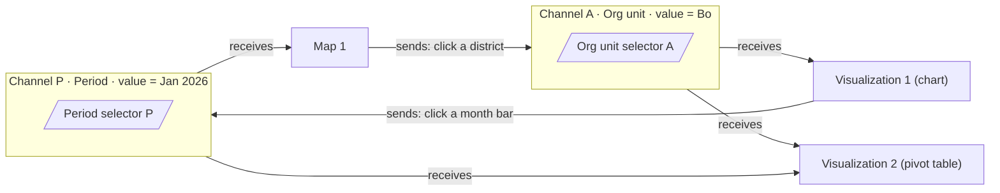
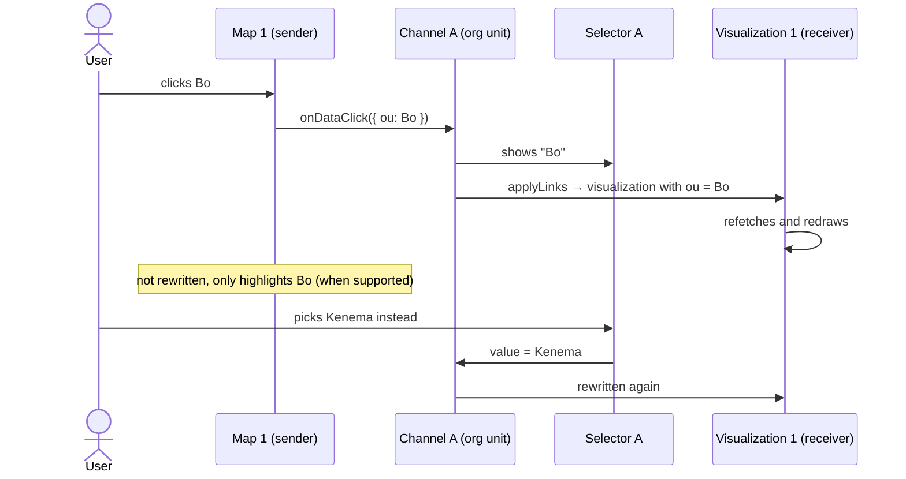
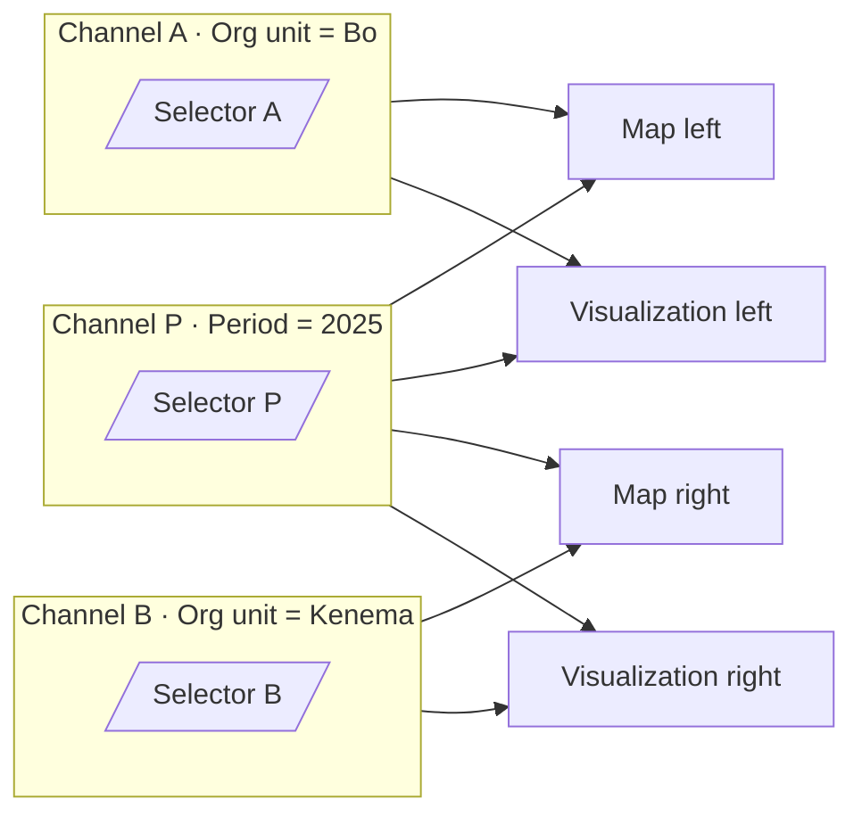

# Interactions between views

- **Status**: §1–3 research (DHIS2 `master` branches, September 2026) · §4–5 decided design · §6 proposal for the upstream PRs. Plan step 5.
- **Related**: [plugins.md](plugins.md) (what the plugins accept), [selector-controls.md](selector-controls.md), [view-settings.md](view-settings.md), [demo-mode.md](demo-mode.md). Terms are defined in the [docs index](README.md#terms).

How views in Linked Analytics drive each other: what other tools do, what the DHIS2 data model and the plugins allow, and the design for this app: the model, the UI, and the changes proposed to the DV and Maps plugins.

In short: a **channel** holds one shared value for one dimension (an org unit, a period, a data item). Views **send** to a channel (a click sets its value), **receive** from it (they're rewritten with the value), or both. A **selector** is a small view that shows and sets a channel's value.

## 1. How other tools do it

| Tool                  | Trigger                                 | Effect on other views                                                                    | Who decides which views react                                                                                                                                                         |
| --------------------- | --------------------------------------- | ---------------------------------------------------------------------------------------- | ------------------------------------------------------------------------------------------------------------------------------------------------------------------------------------- |
| **Power BI**          | Click a data point                      | **Cross-filter** (recompute) or **cross-highlight** (dim the rest, keep totals)          | Matrix: each source → each target = filter / highlight / none. "Sync slicers" groups share a slicer value. Drilling affects only itself unless "Drilling filters other visuals" is on |
| **Tableau**           | Select / hover / menu                   | Filter, highlight, **parameter** (change a value used by a calculation), **set** actions | Named actions: source sheets → target sheets, with field mapping. One-click "Use as filter" on a sheet                                                                                |
| **Superset**          | Click a chart value                     | Adds a cross-filter chip, the other charts refetch                                       | Per chart: emit on/off, plus scoping (which charts receive it)                                                                                                                        |
| **Metabase**          | Click a value                           | "Update a dashboard filter": the clicked column maps to a filter                         | Only charts wired to that filter react. **The source chart is not wired, so it stays unfiltered and you can pick again**                                                              |
| **Kibana**            | Click a value                           | Adds a global **filter pill**                                                            | Everything, unless pinned or disabled                                                                                                                                                 |
| **Grafana**           | Data link                               | Sets a dashboard **variable** (through the URL)                                          | Every panel that uses the variable. Also a shared crosshair (hover sync)                                                                                                              |
| **ArcGIS Dashboards** | Selection change, **map extent change** | Filter, zoom, pan, flash, show pop-up                                                    | Source → target actions. Different data sources are linked by a field or **spatially**                                                                                                |

What most of them share:

- **A selection becomes a shared value** (chip, pill, variable, slicer group) outside any one chart. You can see it and clear it.
- **The source does not filter itself**, so the user can change the selection.
- **Filter vs highlight** is the main split. Highlight needs support inside the chart.
- **Scoping** is per view (emit / receive), or a source × target matrix.
- **Everything is linked by default** (Power BI), with an edit mode on the canvas to change it.
- **Drill is separate from cross-filtering**, and linking the two is opt-in.

## 2. What it means in the DHIS2 data model

Aggregate analytics share one dimensional model: `dx` (data), `pe` (period), `ou` (org unit), plus dynamic dimensions (category option groups, org unit group sets). So a link is **a dimension plus its items**. Applying it is the rewrite dashboard-app already does in `getFilteredVisualization`.

### Org unit (`ou`)

- Items can be UIDs, `LEVEL-n`, `OU_GROUP-x`, or user keywords (`USER_ORGUNIT` …).
- **DV and Maps drill the same way**: `{id, path}` + `LEVEL-(n+1)`. See DV's `onDrill` in `Visualization.jsx` and Maps' `drillUpDown` in `src/util/map.js`.
- **Rule per receiving view, depending on where `ou` sits in it:**
    - on an axis (a bar per district, a choropleth map) → the children of the selection (`id` + `LEVEL-next`);
    - only as a filter (a trend line, a single value) → the selection itself (`id`).
- Earth Engine, facility and org unit layers take `ou` links too (aggregation, boundaries).

### Period (`pe`)

- A received fixed period replaces the view's periods, relative ones included.
- Analytics aggregates to any period type, so a month in a filter works for any view.
- **Rule per receiving view:**
    - `pe` only as a filter → the selected period;
    - `pe` on an axis → the periods of the axis's own type that fall within the selection (a year → its 12 months);
    - if the selection is shorter than the axis type (a month into a yearly axis), the period that contains it.

    This needs a period helper, e.g. from `@dhis2/multi-calendar-dates`, as `@dhis2/analytics` uses.

- **For EV**, which only takes `relativePeriodDate`, use the **end date** of the selected period: "Last 12 months as of 31 Jan 2026" is Feb 2025 – Jan 2026. Line Listing takes `pe` by remounting ([plugins.md](plugins.md#line-listing-and-event-visualizer)).
- **Event layers**: a received period sets the layer's `startDate`/`endDate` to the period's start and end. The Maps plugin doesn't redraw for dates, so this needs a remount until the [Maps PR](#maps-pr-maps-app).
- **Maps timeline and split views are not supported.** The map settings tab won't offer them, and a saved map that uses them is shown with one period. Stepping through periods is done by the **period selector's play mode** instead ([§5.5](#55-selectors-live-in-grid-cells)), which animates every receiver, not only one map.

#### Earth Engine periods

Earth Engine layers have their own period types: `EE_DAILY`, `EE_WEEKLY`, `EE_MONTHLY`, `YEARLY`, plus legacy `BY_YEAR` (16-day, pentad). Each EE period has a start and end date (`system:time_start` / `system:time_end`), and the image is picked by its id (`system:index`). See maps-app `src/util/earthEngine.js` `getPeriods` and the layer configs in `src/constants/earthEngineLayers/`.

Conversion rule:

- same type (DHIS2 month → EE monthly, week → weekly, day → daily, year → yearly): the EE period with the same dates;
- EE type longer than the selection (a month into a yearly population layer): the EE period that contains it;
- EE type shorter than the selection (a year into a monthly layer): not applied. The view keeps its period and shows "Can't show a year on this layer";
- no image for that period yet (dataset lag): the same notice.

Only the Maps plugin can look up EE image ids, through its EE worker. So the host passes the DHIS2 period's start and end dates, and the plugin resolves the image. This is part of the [Maps PR](#maps-pr-maps-app).

### Data (`dx`)

A `dx` link means "show this data item instead". Unlike `ou` and `pe`, the data item is usually what a view is _about_, so the defaults are cautious.

- **Sending is off by default**, even when "Views send clicks" is on. Otherwise a click on a district would also push the map's indicator to every receiver. It can be turned on per view in link mode.
    - A DV series or pivot cell carries its `dx`.
    - A map carries its thematic layer's `dx`.
- **Receiving, by view:**
    - One data item (a thematic layer, a single-indicator chart): it is **replaced**.
    - Several data items (a chart comparing ANC 1 and ANC 4): not by default. If turned on, the view **keeps only the clicked item** when it is one of its own, and stays as it is otherwise.
    - A map with several thematic layers: not in the first version ([map-layers.md](map-layers.md)).
- **Compatibility is checked before applying.** When the check fails, the view stays as it is and shows "Can't show {item} here".
    - Disaggregation: a `co` dimension, or a category dimension (e.g. Sex), on the receiver only works with data elements whose category combo has it. An indicator or program indicator breaks it.
    - Value type: text and boolean items can't be shown on a thematic map or aggregated in a chart.
    - This needs the new item's metadata (`dimensionItemType`, `valueType`, `categoryCombo`, `legendSet`). Look up the exact endpoints with the `dhis2-api-lookup` skill when implementing.
- **Settings tied to the old item must be reset:**
    - Map thematic layer: `legendSet`. Use the new item's legend set when the layer used "legend from data item", otherwise automatic classes.
    - DV: per-series options (the `series` option keyed by `dx` id: axis, chart type), `targetLineValue`, `baseLineValue`, fixed axis ranges, and the visualization's legend set.
    - Titles: see [Titles after a rewrite](#titles-after-a-rewrite-all-dimensions).
- **The data selector is a short list, not the full picker.** In the selector's settings tab, the author chooses candidate items with `DataDimension` (e.g. ANC 1, ANC 4, Penta 3). The selector then shows them as a simple select: a "parameter" in Tableau's sense.
- Later: drilling a data element into its disaggregations (category option combos). This is the `dx` version of "children on an axis".

### Titles after a rewrite (all dimensions)

- In dashboard mode a DV chart shows only a **custom** title, and builds its **subtitle from the filter dimensions** (`@dhis2/analytics` `dhis_highcharts/title` and `subtitle`). So a linked `ou` or `pe` in the filters shows up in the subtitle on its own.
- A custom title or subtitle ("ANC coverage, Bo, 2025") goes stale, so `applyLinks` clears a custom `title` and `subtitle` on any view it rewrites. The view header's badges show what is linked.
- Maps show their legend, which includes the period.

### Filter vs highlight

Two ways for a receiver to react:

|              | Filter (rewrite)                     | Highlight                                 |
| ------------ | ------------------------------------ | ----------------------------------------- |
| What you see | Only the selection (or its children) | Everything, with the selection emphasized |
| Cost         | Refetch and redraw in each receiver  | No refetch: the plugin only restyles      |
| Needs        | Nothing upstream for DV and Maps     | A new plugin prop (upstream)              |
| Good for     | Drilling down, "show me Bo"          | Comparing, "where is Bo among the others" |

- **Highlight in the sender matters most.** A sender isn't filtered by its own clicks, so without highlight it shows no trace of what was selected. With it, the clicked district stays outlined on the map, and the clicked bar stays selected.
- **Highlight rules**, which reuse the paths and the period helper:
    - the item is in the view → it is emphasized and the rest dimmed;
    - the item isn't there but its ancestor is (Bo in a chart by region) → the region containing Bo is emphasized;
    - for periods, the containing or contained periods on the axis.
- **What each plugin would do:**
    - DV charts: dim the Highcharts points that don't match. Pivot tables: a CSS class on the matching headers and cells.
    - Maps: style the matching features (outline, others faded).
    - Both must apply it **without refetching**. DV's `VisualizationPluginWrapper` refetches when `visualization`, `filters` or `forDashboard` change, so the new prop must stay out of that dependency list.
- **Contract**: one more optional prop in the same PRs as `onDataClick` ([§6](#6-upstream-prs)): `highlight?: { ou?: string[]; pe?: string[]; dx?: string[] }`.
- **In the app**: each receiving member gets a mode, `filter` or `highlight` (Power BI's two icons). A sender always gets `highlight` for its own clicks, when the plugin supports it. The default for receivers is `filter` until the plugins support highlight.
- **Later, once highlight exists**: hover sync (Grafana's shared crosshair), which needs an `onDataHover` callback. And multi-select with Ctrl/Cmd-click, which adds to the channel value instead of replacing it: `onDataClick(click, { additive: boolean })`.

## 3. What the plugins allow without upstream changes

What each plugin accepts, checked live and in the code, is in [plugins.md §2](plugins.md#2-plugin-by-plugin). What matters for links:

- **DV and Maps take links as object rewrites.** DV updates in place. Maps updates in place for `ou` and `pe` on thematic layers; other changes need a remount until the Maps PR ([plugins.md §4](plugins.md#4-what-this-means-for-the-app)).
- **DV already sends org units**: passing `onDrill` turns on its "Change org unit" menu (pivot cells, bar and column charts), which calls `onDrill({ ou: { id } })` to drill up or `onDrill({ ou: { id, path, level } })` to drill down, with `level` a UID. It's usable as an interim sender before the [DV PR](#dv-pr-dhis2analytics--data-visualizer-app). Limits: org units only (`// TODO drillData?.pe`), a chart offers it only when `ou` is on the category or series, and it finds the org unit by name.
- **Maps sends nothing**: its clicks stay inside the plugin (left click a popup, right click the drill menu).
- **Line Listing** takes `ou` and `pe` by remounting. **EV** fetches by id and takes only `relativePeriodDate`. Neither sends clicks.
- **`filters` keys that already work:**
    - `relativePeriodDate` evaluates relative periods as of a date. DV applies it (`getRequestOptions.js`, including year-over-year), and so do LL and EV. The Maps _plugin_ drops it, but reads it from each map view (on mount only).
    - `userOrgUnit` (DV only) changes what `USER_ORGUNIT` resolves to.
- **`@dhis2/analytics` has the pieces**: the pickers (`PeriodDimension`, `OrgUnitDimension`, `DataDimension`, `DynamicDimension`, see [view-settings.md](view-settings.md#what-dhis2analytics-offers)) and the layout helpers (`layoutReplaceDimension`, `layoutGetDimension`, `axisHasOuDimension`, `axisHasPeriodDimension`…).

### Target scenarios

| Scenario                                             | Click side                           | Receiving side                                                                                  |
| ---------------------------------------------------- | ------------------------------------ | ----------------------------------------------------------------------------------------------- |
| Click a period bar in DV → the map shows that period | Missing: needs `onDataClick` in DV   | Works: rewrite `pe` in each thematic layer. EE layers need the period conversion in the Maps PR |
| Click an org unit on the map → the chart shows it    | Missing: needs `onDataClick` in Maps | Works: rewrite `ou`, with the axis rule                                                         |
| Click a district bar in DV → the map drills into it  | Exists: DV `onDrill` (interim)       | Works, but EE layers need the `didViewsChange` fix                                              |

## 4. Model: channels

### In pictures

**One channel per shared value.** Arrows into a channel are **sends** (a click sets the value). Arrows out are **receives** (the view is rewritten). The selector is the channel's visible handle: it shows the value and can set it.



Map 1 sends org units and receives periods. Visualization 1 does the opposite. Visualization 2 only receives. No view receives what it sends itself, so nothing loops.

**What happens on a click:**



**Why several channels for one dimension: comparing.** Two org unit channels drive two halves of the grid:



Each view is in at most one org unit channel, so the left views show Bo and the right ones Kenema. All four share the period.

**Why channels and not "source → targets"**: wiring each source directly to its targets breaks down as soon as a selector _and_ a map can both set the org unit, because there are then two sources to reconcile. A channel holds one value, and all its senders and the selector write to that value, so there's nothing to reconcile.

### Rules

- **A channel** is one dimension with one shared value (e.g. "Org unit A"), plus the views that belong to it. It is close to Power BI sync-slicer groups, Grafana variables and Tableau filter groups.
    - A view joins as **sender** (its clicks set the value), **receiver** (it is rewritten with the value), or both.
    - Several channels can share a dimension ("Org unit A" and "Org unit B", to compare two districts side by side).
    - A view belongs to **at most one channel per dimension**, so it never gets two values for one dimension.
    - A sender doesn't apply its own clicks (Metabase), which also prevents cycles.
- **The value** is a list of items (a selector can select several; a click sets one), plus `path` and `level` for org units. The axis rules apply to each item.
- **Selectors** are the visible handle of a channel: pickers for period, org unit, data, or one dynamic dimension (chosen when the selector is added).
    - A channel has **at most one selector**, and can have none (map → chart only).
    - A click in channel A shows up in selector A, because they share one value.
- **Life cycle:**
    - Closing a view removes its memberships.
    - A channel with no selector and no members is deleted.
    - Removing a selector keeps its channel if views still use it; the value can then be cleared from a header badge.
- **State**, a new `links` slice beside `workspace`:
    ```ts
    channels: { [channelId]: {
        dimension, color, label,          // label: "A", "B", "P"…, shown with the color
        value?: Item[], selectorViewId?,
        members: { [viewId]: { send: boolean; receive?: 'filter' | 'highlight' } }
    } }
    settings: { viewsSendByDefault, newViewsJoinChannels, paused }
    ```
- **Applying**: a pure `applyLinks(visualization, incomingValues)`, built on the `getFilteredVisualization` logic plus the axis rules in [§2](#2-what-it-means-in-the-dhis2-data-model), using the analytics layout helpers. Unit-tested.
    - A view is only rewritten when one of its incoming values changes.
    - Selector changes are applied on confirm, not on every keystroke. Each change refetches in every receiver.
- **What each view can send and receive in the first version**, once the upstream PRs land (until then Maps sends nothing, and needs a remount for `dx`; [§3](#3-what-the-plugins-allow-without-upstream-changes)):

    | View | Sends                                             | Receives                                                                                                                       |
    | ---- | ------------------------------------------------- | ------------------------------------------------------------------------------------------------------------------------------ |
    | DV   | dimensions on its axes (`dx` off by default)      | `ou`, `pe`, dynamic dimensions, `dx` (see [Data](#data-dx))                                                                    |
    | Maps | `ou`; `dx` of its thematic layer (off by default) | `ou` (all layers); `pe` (thematic, event, and EE with conversion); dynamic dimensions (thematic); `dx` (single thematic layer) |
    | LL   | nothing                                           | `ou` and `pe` by remounting; `relativePeriodDate` in place                                                                     |
    | EV   | nothing                                           | `pe` through `relativePeriodDate`, for relative periods only                                                                   |

- **Each receiving member has a mode**: `filter` (rewrite) or `highlight` ([Filter vs highlight](#filter-vs-highlight)). It is `filter` until the plugins support highlight.
- **Persistence** (plan step 6): channels, their values and the settings are saved with the workspace.

## 5. UI: configuring interactions in the grid

Three layers. Most users never go past the first.

### 5.1 Zero configuration by default

- **Adding a selector creates a channel** with the next color and label. Every view that can receive that dimension, and isn't in another channel for it, joins as receiver.
- **Views send by default.** A DV or Maps view joins, as sender, the channel of each dimension it can send. If none exists, its first click creates one, with no selector.
- **New views join existing channels** the same way.
- Result: add a map and a chart, click a district, and the chart follows.

**Workspace settings**, in the menu of the "Links" button in the tools strip header ([§5.4](#54-where-the-wiring-is-set-no-separate-tab)). They change the defaults only; link mode can still override any single view.

- **Views send clicks** (on). When off, new views only receive, and clicks keep the plugin's own behavior (e.g. the drill menu).
- **New views join existing channels** (on). When off, a new view starts unlinked.
- **Pause links**: receivers show their saved visualization, and channels keep their values. The badges show the paused state.

### 5.2 Channels are visible in the grid

```
┌──────────────────────────────┐ ┌──────────────────────────────┐
│ Org unit A  [ Bo ▾ ]  ✕      │ │ Period P  [ Jan 2026 ▾ ]  ✕  │   ← selectors,
└────────────── A ─────────────┘ └────────────── P ─────────────┘     border in channel color
┌──────────────────────────────┐ ┌──────────────────────────────┐
│ Map 1         A→  P←    ⋯  ⛶ │ │ Visualization 1  A← P→  ⋯  ⛶ │   ← header badges:
│        (map plugin)          │ │       (chart plugin)         │     color + letter,
└──────────────────────────────┘ └──────────────────────────────┘     → sends, ← receives
```

- **Header badges**: the channel's color **and letter** (never color alone), with → for send and ← for receive.
    - Hovering or focusing a badge outlines every member of the channel and shows the value ("Org unit: Bo, from Map 1").
    - The badge menu can clear the value.
- **A selector's border** has its channel color, so it reads as a group with the views it drives.
- **Feedback**: receivers' badges pulse when the value changes. The live region announces the channel and the value, through `getWorkspaceAnnouncement`.

### 5.3 Link mode (like Power BI "Edit interactions")

- Turned on from the "Links" button in the tools strip header, or from a link button in a view's header (`tabs/view-actions.tsx`). Esc or the button turns it off.
- While on, plugin content is dimmed and not clickable, using the same overlay and pointer-events handling as drags.
- Each view shows a card with one row per dimension it can send or receive:
    ```
    Org unit   ( A  B  + new  — none )   [→ send] [← receive]
    Period     ( P  + new  — none )      [→ send] [← receive]
    Data       — not supported (Event Visualizer)
    ```
    - Picking a channel moves the view into it; "none" takes it out.
    - A dimension the view can't handle says why.
- A selector's card only has the channel choice.

### 5.4 Where the wiring is set (no separate tab)

There is no Interactions tab. Its jobs have better homes:

| Job                                                      | Home                                                                                                                                                                         |
| -------------------------------------------------------- | ---------------------------------------------------------------------------------------------------------------------------------------------------------------------------- |
| One view's wiring (channel, send, receive per dimension) | A **"Links" section in the view's settings tab**, with the same card as in link mode. A selector's settings tab holds its channel choice.                                    |
| The keyboard and screen-reader path                      | Select a view and its settings tab, with Links, comes forward, like every other setting.                                                                                     |
| An overview of all the wiring                            | **Link mode** on the grid. With at most 4 plugins and a few selectors, outlines and badges say more than a table.                                                            |
| Workspace settings (§5.1)                                | A **"Links" button in the tools strip header**, next to collapse and move. It turns link mode on, and its menu holds the settings. "Pause links" is one click from anywhere. |

So the tools strip holds "Add views" and one settings tab per view, and there is one rule: select something to configure it.

What this gives up: a list of every channel, including those without a selector. They show as badges and in link mode, and they're deleted once no view uses them. If channels ever need names or more management, a channel list can come back in the Links menu.

### 5.5 Selectors live in grid cells

- Selector types appear in the "Add views" palette. They have no iframe, so they **don't count toward the 4-plugin limit**; each selector type is capped at the number of plugins + 1.
- **Placing and sizing** follow the grid rules ([workspace-grid.md §2–4](workspace-grid.md#2-view-kinds-and-limits)):
    - a clicked selector joins the **selector bar** across the top, or starts it; dragged, a selector goes anywhere, like any view. Tall controls such as trees are proposed to go to a **selector column** instead ([selector-controls.md §6](selector-controls.md#6-where-selectors-go));
    - it gets its preferred size when placed, and has **no maximum**: it can be dragged as big as a plugin, and scales with the window like any view;
    - it keeps a tab header like a plugin, so it moves, swaps and closes the same way.
- **Its control** fills, wraps, scrolls or collapses to fit its cell ([selector-controls.md](selector-controls.md)). Clicking a compact control opens the same `@dhis2/analytics` picker DV and Maps use for that dimension ([view-settings.md](view-settings.md#what-dhis2analytics-offers)). The data selector shows its short list instead ([Data](#data-dx)).
- **A selector's settings tab** holds its dimension, its control (drop-down, radio group, tree…) and the picker options.
- **The period selector's play mode** replaces Maps timelines. It lives in the selector itself, not in its settings tab, since it's used while looking at the views:
    - the user picks a range and a step (e.g. the months of 2025) in the selector's picker;
    - ▶ steps the channel value through it, ⏸ stops, ◀ ▶ step by hand;
    - each step waits until every receiver has finished loading, then a set delay (e.g. 1.5 s), so a slow view doesn't fall behind and the refetches (every receiver, every step) are spread out;
    - **receivers report loading through `onLoadingComplete` once the upstream PRs add it** (DV's wrapper must forward it, and Maps adds it, [§6](#6-upstream-prs)). Until then no plugin reports loading, and play mode steps on a fixed delay ([plugins.md §4](plugins.md#4-what-this-means-for-the-app));
    - playing pauses while link mode is on or a view is being dragged.

### 5.6 Drilling the view you click

A sender isn't rewritten by its own clicks, but you may still want to drill it. The view's ⋯ menu gets "Drill into {value}" and "Drill up", which rewrite that view with the same `applyLinks` rules. With "Views send clicks" off, the plugin's own drill menu is back.

### 5.7 Later

- **Drag to connect**, Figma-style: drag a badge onto a view to add it to that channel. This competes with dockview's drag and drop.
- **Templates**, e.g. "compare two org units": two channels and a 2×2 layout in one go.

## 6. Upstream PRs

One shared click callback for DV and Maps, plus highlight and a load signal. These are optional props: if the host doesn't pass them, nothing changes, so the dashboard is unaffected.

### Contract (same in both plugins)

```ts
type DataClickItem = { id: string; name?: string }
type DataClick = {
    ou?: DataClickItem & { path?: string; level?: string } // level UID, as DV's onDrill sends
    pe?: DataClickItem
    dx?: DataClickItem
}
onDataClick?: (click: DataClick, options: { additive: boolean }) => void
highlight?: { ou?: string[]; pe?: string[]; dx?: string[] }
onLoadingComplete?: () => void // DV's wrapper must forward it; Maps adds it
```

- The payload holds only the clicked point's coordinates (the dimensions on its axes), as ids. `additive` is true for Ctrl/Cmd-click.
- `highlight` restyles matching items without refetching ([Filter vs highlight](#filter-vs-highlight)).
- When `onDataClick` is passed, a click calls it directly and skips the plugin's own drill menu.
- Agree on the names with the maintainers (Community of Practice or the PR descriptions), so both plugins ship the same shape.
- Where the payload and `filters` overlap, reuse the dashboard's `dashboardItemFilters` shape (`{ ou: [{ id, name, path }], pe: [...] }`, dashboard-app#3264).
- The fake plugins in [demo-mode.md](demo-mode.md) implement this contract (`proposed` profile), so it can be tried before the PRs.

### Maps PR (maps-app)

1. `Plugin.jsx`: forward `onDataClick` and `filters` through `MapContainer` to `Map.jsx`.
2. `Map.jsx`: when `onDataClick` is set, a feature click calls it instead of opening `ContextMenu`. Say which click it takes over: left click opens the feature popup, right click the drill menu. Payload:
    - `ou` from `feature.properties` (`id`, `name`, `level`, and `path` from `parentGraph`), for thematic, org unit, facility and EE layers;
    - `dx` for thematic layers;
    - event layers: not in this PR.
3. Apply `filters.relativePeriodDate` on the plugin path. `thematicLoader.js` and `util/event.js` already accept it.
4. `didViewsChange` (`src/util/pluginHelper.js`):
    - stop skipping EE layers, and compare their `period`;
    - compare `startDate`/`endDate`;
    - handle a changed number of map views (`oldViews[i]` is then undefined and the plugin crashes);
    - compare `columns` (the thematic data item), `relativePeriodDate` and the style fields, or simply compare whole views;
    - keep `MapView` mounted while layers reload, so a linked change keeps the user's zoom and pan.
5. **EE period from dates**: when an EE layer's `period` has `startDate`/`endDate` but no `id`, resolve the image with `getPeriods`, using the [Earth Engine conversion rule](#earth-engine-periods). Report "not available" when there is no match. `earthEngineLoader.js` builds its filter from `period.id` only.
6. `highlight` prop: style matching features without reloading layers.
7. `onLoadingComplete` prop: called when `mapIsLoaded` becomes true in `Map.jsx`.
8. Unit tests for the payload builder, `didViewsChange` and the EE period resolution.

### DV PR (@dhis2/analytics + data-visualizer-app)

1. **analytics** `PivotTableValueCell.js`: `PivotTableEngine.getRaw` already computes `peId`. Pass `ouId`, `peId` and the `dx` id on click, and make a cell clickable when it has either `ouId` or `peId`.
2. **analytics** `dhis_highcharts/plotOptions.js`: point clicks are only wired for column and bar charts, and send only names. Also wire line and area charts, and send the point index.
3. **data-visualizer-app** `VisualizationPluginWrapper.jsx`: pass through `onDataClick` and `highlight`, and forward the host's `onLoadingComplete` (the wrapper uses it for its own loading state). `VisualizationPlugin.jsx`: accept `onDataClick`, map the click to `{ dx, pe, ou }` ids through `responses[0].metaData`, extending the existing org unit lookup, and call it.
4. **Highlight**: analytics charts dim non-matching points, and pivot tables add a class to matching headers and cells. DV passes `highlight` through without adding it to the refetch dependencies in `VisualizationPluginWrapper`.
5. Tests in both repos, and bump analytics in DV.

### This app's side

- The plugin adapter re-types `Plugin` with `onDataClick`, `highlight`, `onLoadingComplete` and `filters` (as in EV's `plugin-host-app.tsx`), and keeps each view's props memoized, since `Plugin` re-sends all of them when one changes.
- `onDataClick` sets the value of the channel the view sends to. `applyLinks` then rewrites the receivers, and the selector shows the value.
- Clicking the same item again clears the value (Superset style).
- A plugin too old to call `onDataClick` is detected from its app version in `/api/apps`. Link mode then shows "can't send clicks yet".
- Dev only: point a view at a locally running plugin (e.g. `http://localhost:3001/plugin.html`) to test the upstream branches.

### Checks for the PRs

In the browser, with the plugins served locally:

- Click a monthly bar in DV, and the map shows that month.
- Click a district on the map. The trend chart shows that district; a chart with a bar per district shows its children.

## 7. Order of work

1. **Grid prerequisites** (done in the grid milestone): view kinds (plugin or selector), a plugin-only view limit, and a minimum and preferred size per view type ([workspace-grid.md](workspace-grid.md#2-view-kinds-and-limits)).
2. Channels, selectors, link mode, the Links button and the settings tab's Links section, with `ou` and `pe` receivers in DV and Maps. Needs plugins rendered (plan step 3), or the fake plugins of [demo-mode.md](demo-mode.md).
3. DV `onDrill` as the interim `ou` sender. Maps views remount for the changes `didViewsChange` misses, including a `relativePeriodDate` set per map view ([plugins.md §4](plugins.md#4-what-this-means-for-the-app)).
4. The two upstream PRs (`onDataClick`, `highlight`, `onLoadingComplete`, EE periods), then click senders and sender highlight.
5. Period selector play mode (on a fixed delay until the PRs add `onLoadingComplete`).
6. `dx` channels and the data selector.
7. LL receivers by remounting, and EV `relativePeriodDate` receivers.
8. Highlight mode for receivers, hover sync, multi-select, drag to connect, templates.

## 8. Decisions and open questions

**Decided:**

- **Drill rule per receiving view**: `ou` on an axis → the children of the selection; `ou` only as a filter → the selection itself. Periods follow the same idea ([§2](#2-what-it-means-in-the-dhis2-data-model)).
- **Cycles**: a sender never applies its own clicks. **Reset**: clear the channel from its selector or a header badge.
- **Views send clicks by default**, with workspace settings to change that ([§5.1](#51-zero-configuration-by-default)).
- **No Maps timelines**: the period selector's play mode steps through periods instead.
- **No separate Interactions tab** ([§5.4](#54-where-the-wiring-is-set-no-separate-tab)).

**Open:**

- The upstream prop names (`onDataClick`, `highlight`), to agree with the maintainers.
- How to show "not supported" for EV and LL.
- Whether a saved map using a timeline or split view should warn when opened in a view.
- Positioning against the Dashboard app: this app focuses on ad hoc exploration and interactions.

## Sources

- [Power BI visual interactions](https://learn.microsoft.com/en-us/power-bi/create-reports/service-reports-visual-interactions), [filters and highlighting](https://learn.microsoft.com/en-us/power-bi/create-reports/power-bi-reports-filters-and-highlighting)
- [Tableau actions](https://help.tableau.com/current/pro/desktop/en-us/actions.htm)
- [Superset cross-filter scoping](https://github.com/apache/superset/discussions/14270), [Preset cross-filtering](https://docs.preset.io/docs/cross-filtering)
- [Metabase interactive dashboards](https://www.metabase.com/docs/latest/dashboards/interactive)
- [Kibana dashboards](https://www.elastic.co/docs/explore-analyze/dashboards/using)
- [Grafana data links](https://grafana.com/docs/grafana/latest/visualizations/panels-visualizations/configure-data-links/)
- [ArcGIS Dashboards actions](https://doc.arcgis.com/en/dashboards/latest/create-and-share/actions.htm)
- DHIS2 code (all on `master`, September 2026):
    - [event-visualizer-app](https://github.com/dhis2/event-visualizer-app): `src/dashboard-plugin.tsx`, `src/plugin-host/plugin-host-app.tsx`
    - [line-listing-app](https://github.com/dhis2/line-listing-app): `src/components/Visualization/useAnalyticsData.js`, `src/components/Visualization/VisualizationPluginWrapper.jsx`
    - [data-visualizer-app](https://github.com/dhis2/data-visualizer-app): `src/components/VisualizationPlugin/{VisualizationPluginWrapper,VisualizationPlugin,ContextualMenu}.jsx`, `src/modules/getRequestOptions.js`, `src/components/Visualization/Visualization.jsx`
    - [maps-app](https://github.com/dhis2/maps-app): `src/components/plugin/{Plugin,MapContainer,Map,ContextMenu}.jsx`, `src/util/{map,pluginHelper,earthEngine}.js`, `src/loaders/earthEngineLoader.js`
    - [analytics](https://github.com/dhis2/analytics): `src/components/PivotTable/PivotTableValueCell.js`, `src/modules/pivotTable/PivotTableEngine.js`, `src/visualizations/config/adapters/dhis_highcharts/{plotOptions,title/index,subtitle/index}.js`
    - [dashboard-app](https://github.com/dhis2/dashboard-app): `src/components/Item/VisualizationItem/Visualization/getFilteredVisualization.js`
